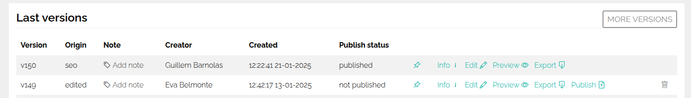

# Features

## Technologies {#technologies}

- [Symfony](https://symfony.com/) The leading PHP framework to create websites and web applications. Built on top of the Symfony Components.
- [Bootstrap](https://getbootstrap.com/) Build fast, responsive sites.

{.img-fluid}

## Pure Symfony {#pure-symfony}

- **Rock-Solid Foundation**: Leverage the stability and security of the robust Symfony framework, known for its enterprise-grade features.
- **Scalability & Performance**: Benefit from Symfony's proven performance and scalability to handle demanding web projects and growing traffic.

## Multi-site {#multi-site}

**Effortless Multi-site Management**: Create and manage multiple websites from a single, centralized platform, simplifying content management across your web properties.

## Multi-language {#multi-language}

**Global Reach**: Deliver content in multiple languages, catering to a wider audience and expanding your global reach.

## Inline Content Editing

Edit all the content directly on the page  (or you can also do it in the module editor, ¡you choose!)

## Versions and History

All changes are stored as new versions, you can go back to any previous version at any time. You can also see who did the
changes to the version and when.

{.img-fluid}

## Publish and Unpublish

You can publish and unpublish any page, any version, at any given time. 

## Live Preview

You can see how the page will look like before publishing it.

## Module-based editor

You can create your own modules and blocks, and use them in any page you want. You can also use the modules and blocks we provide.
Each instance of a module is unique in a page, but blocks are shared between pages (for example, you create one "Black Friday" banner
and want to use it in all the pages, you can do it with blocks).

## Extensible {#extensible}

**Limitless Expansion**: Extend functionality enabling you to add unique features and tailor the CMS to your evolving requirements.

## Powerful Translation System {#powerful-translation-system}

You can translate inline, or translate from the translation management page. You can also export and import translations, you choose.

## Flexible {#flexible}

**Unmatched Flexibility**: Adapt your CMS to your specific needs with a flexible architecture that allows for seamless customization and integration.

## SEO ready and friendly {#seo-ready-and-friendly}

Should we say this in 2025? It should be a must, right? Symfonic is SEO ready and friendly, you can edit all the meta tags, title, description, etc from 
an specific SEO tab in the page editor.

## AI ready {#ai-ready}

**AI-Ready Infrastructure**: Embrace future possibilities by integrating AI services and functionalities for enhanced content management and user experiences.

## Performance {#performance}

**Blazing-Fast Speed**: Deliver a seamless browsing experience for your users with the CMS's optimized performance and efficient resource management.

