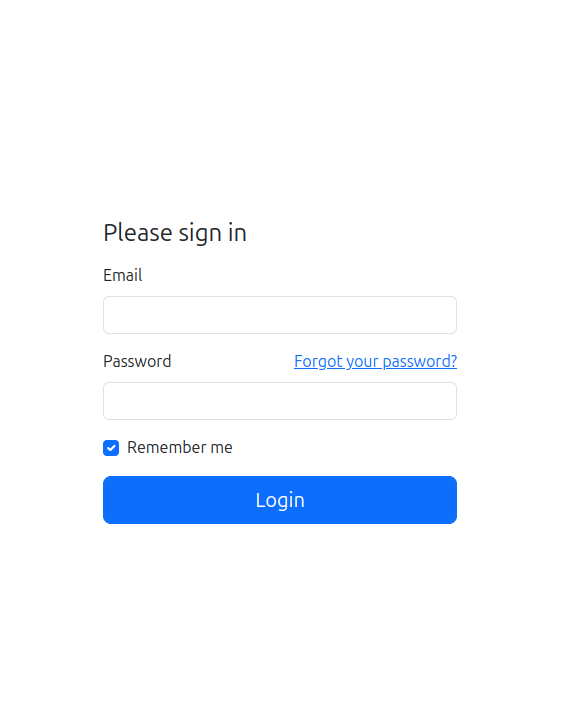

# Symfonic stansalone

## Description
[Symfonic Standalone](https://github.com/softspring/symfonic-standalone) is a great way to dive into the world of Symfonic. With a quick and easy setup, you can have a fully functional local development environment in minutes.


## Description

Symfonic Standalone is a great way to dive into the world of [Symfonic](https://github.com/softspring/symfonic). With a
quick and easy setup, you can have a fully functional local development environment in minutes.
fully functional in minutes.

## Installation

**1. Clone this repository:**

```bash
    git clone https://github.com/softspring/symfonic-standalone
```

**2. Install dependencies**

1. [Symfony CLI](https://symfony.com/download):

```bash
curl -1sLf 'https://dl.cloudsmith.io/public/symfony/stable/setup.deb.sh' | sudo -E bash
sudo apt install symfony-cli
```

2. [Docker](https://docs.docker.com/get-docker/):
   Choose one option.

3. PHP

```bash
sudo apt install php-cli 
sudo apt install php-mysql
```

4. Composer

```bash
sudo apt install composer
```

5. NPM
   (Node >= 18)

```bash
sudo apt install npm
```

3. Lift the containers

```bash
  docker compose up -d --force-recreate
```

4. Start the Symfony server

```bash
  symfony server:ca:install
  symfony server:start -d
```

5. Execute migrations

```bash
  bin/console doctrine:migrations:migrate -n
```

6. Install front-end dependencies

```bash
  npm install
  npm run dev
```

7. Create a test user. In this case, the user is “admin”, the email is “email@example.com” and the password is “admin”.

```bash
  bin/console sfs:user:create admin email@example.com admin
  bin/console sfs:user:promote email@example.com 
```

8. (Optional) If you want an example page, you have to execute the following command.  Then, you can view the page at https://127.0.0.1:8000/admin/en/cms/pages/ , its name is 'Home'.
   If you publish it, you can see it at https://127.0.0.1:8000/en/home.
   

```bash
  bin/console example:command
```
  
## Usage

Open your browser and go to https://127.0.0.1:8000/app/en/login.

1. Log in with the email and password you created in the previous step.


2. You are done! You can now start working with Symfonic Standalone at https://127.0.0.1:8000/admin/en/.


