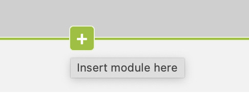
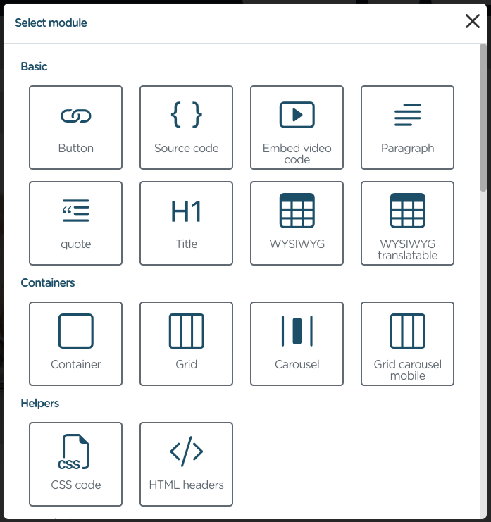
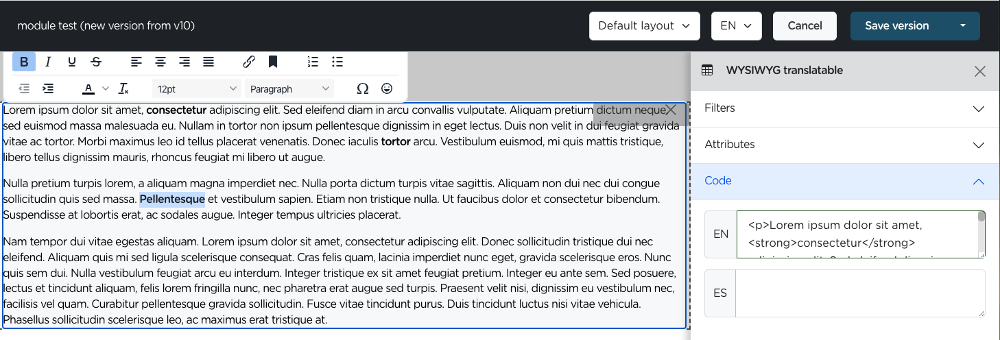

# Adding modules or blocks to a page

Once you've successfully created a page in Symfonic CMS, you can add modules and blocks. These building blocks empower you to structure and present your content in a visually appealing and organized manner.

## Accessing the content section of a page

- Navigate to the Symfonic CMS administration panel.

- In the **left sidebar**, locate the **CMS/Pages** section.

- Use the search bar or filter options to **find** the specific **page** you want to edit. You can search by page name, Status, or other relevant criteria.

- Once you have found the page you want to edit, **click on Content** to open it or click on View and click on the Content tab.

## Understanding Modules and Blocks

### Modules

A module is the minimum unit of content that can be added to a page or content type. A module can be a title block, a card, hero, containers and grids, etc.

One of the SfsCms best and powerful features is that custom modules can be created easily.

Also, it is posible to add modules collections.

### Blocks

A block is a piece of content that can be used in many pages, content types, or directly from twig templates.

Blocks can be defined as static (just twig code, not editable) or dynamic, and can be singleton or many times instantiable. This means that an instance of a block can be created just once or many times.

## Adding Modules/Blocks

On the content page by hovering over the gray parts, an add button will appear like the one in the image or in the primary color you have defined.

{.img-fluid}

Click on it, a modal will open with all the available blocks and modules.

{.img-fluid}

Select the module or block you want to add and click on it.

{.img-fluid}

We have selected the WYSIWYG translatable module that allows you to add formatted and translatable text, as you can see in the image when you click on the module you can open the module edition on the right side.
Here we can see the following options:

- Filters: to specify the languages in which the module's content should be displayed. This ensures that your multilingual content is presented to the appropriate audience.
- Attributes: Assign a class and ID to the module for further customization and styling within your website's CSS.
- Code: Access and modify the HTML code generated by the WYSIWYG editor in the "Code" section. This advanced option grants finer control over the module's structure and presentation.

On the left side of the page you will see the **visual editing**. Utilize the visual editing tools to easily format text, insert links, images, and other multimedia elements within the WYSIWYG editor.

