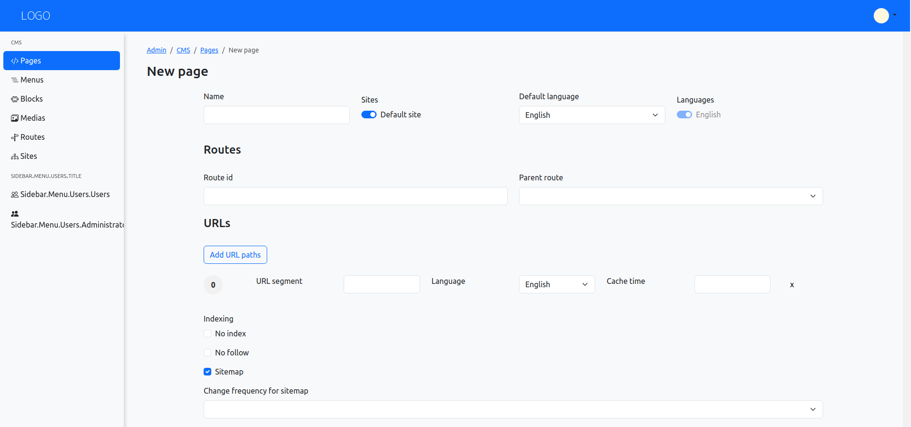

# Creating a New Page in Symfonic CMS

his user manual will guide you step by step through the process of creating a new page in the Symfonic CMS administration panel.

## Accessing the Page Creator {#accessing-the-page-creator}

Navigate to the Symfonic CMS administration panel.
In the **left sidebar**, locate the **CMS/Pages** section.
Find the **New Page button** located in the top right corner of the Pages section.

## Filling Basic Information {#filling-basic-information}

Once you click on New page, a form will appear to define the page details. You need to fill in the following information:

- **Name**: Enter the name that will be displayed internally to identify the page.
- **Sites**: Select the site(s) where the page will be available.
- **Route Identifier**: This field defines the internal URL of the page. It should be unique and descriptive.
- **Parent route** (Optional): If the page is a subpage of another page, you can select the parent page here.
- **Default Language**: Select the main language in which the page content will be displayed by default.
- **Setting Up Additional Languages** (Optional): Symfonic CMS allows you to create multilingual content. If your page needs to be available in multiple languages, you can enable them.
- **Indexing Options** (Optional):
    - **No Index**: Check this box if you want the page to be visible to search engines (default).
    - **No Follow Links**: Enable this option if you want to prevent search engines from following the links on this page.
    - **Add to Sitemap**: Check this box to include the page in the sitemap generated by Symfonic CMS.
      - **Frequency of updating your sitemap**: Define how often the content of the page is updated.
      - **URL priority in the sitemap**: Set the priority of the page in the sitemap.

{.img-fluid}

Once you have completed the basic information and desired options, click on the Create page button to create the page on your website.

>Saving a new page will take you to the page content edition, where you can add modules or blocks, which we will see in the [next section](user-manual/adding-modules-or-blocks.md) of this user manual.

>The page is not yet published so it is not accessible from the public web site.
